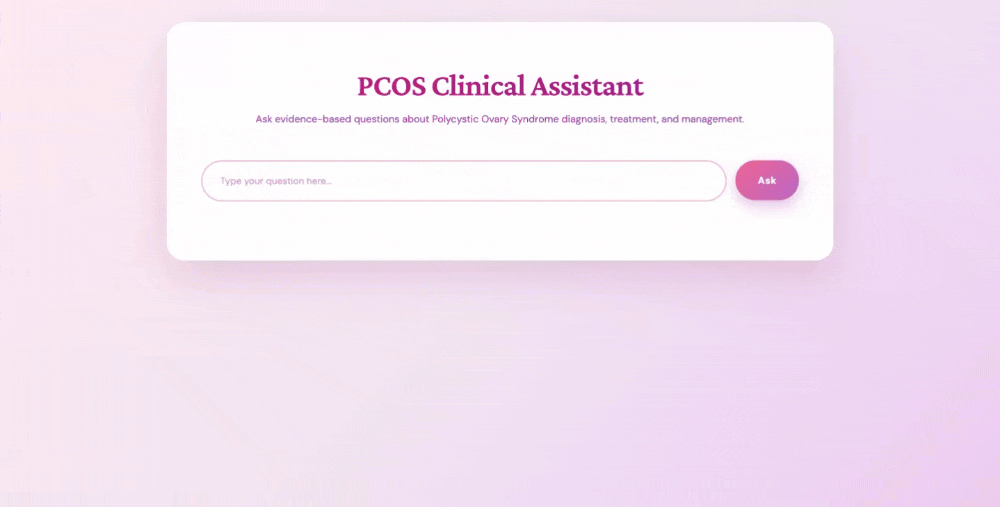

# pcos-rag-app
Clinical literature RAG for polycystic ovary syndrome (PCOS)





## Tech Stack
**Backend:** Python, FastAPI, LangChain, ChromaDB, OpenAI  
**Frontend:** HTML/CSS/JavaScript


## Project Structure
```
pcos-rag-app/
│
├── frontend/
│   ├── index.html          
│   └── style.css        
│
├── ingest.py               # Loads PDFs into vector DB
├── rag.py                  # Retrieval + LLM logic
├── main.py                 # FastAPI server
├── requirements.txt        # Python dependencies
├── .gitignore            
└── README.md             
```

